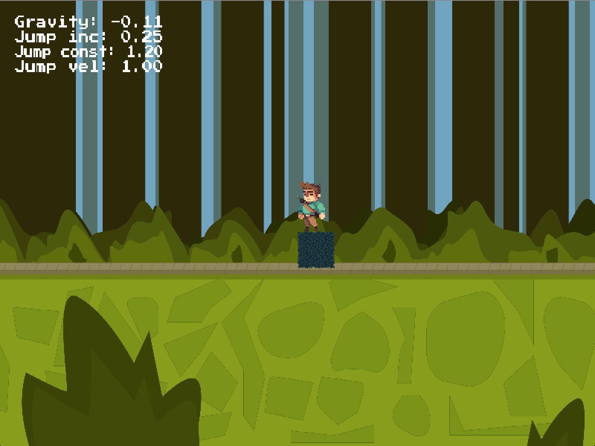

# Runny Jumpy Guy

An exploration in game development with [Go](https://golang.org).

## Background

This project is based on the 
[Just for Func Flappy Gopher videos](https://github.com/campoy/flappy-gopher)
which I highly recommend you watch first.

The game is not meant to be a game and never will be a game.
However, I may add more features as long as I think it's fun.

## Getting started

Build the game with `go build`
and run it with `./runny-jumpy-guy`.

Then run around and jump.

In the game you can tweak some of the physics:

* **Gravity**: Press `Q` to increase, press `A` to decrease.
* **JumpConstant** Press `W` to increase, press `S` to decrease.
* **JumpIncrease** (the force of the jump if you will) press `E` to increase,
  press `D` to decrease.
* **InitialJumpVelocity** Press `R` to increase, press `F` to decrease.

Press `ESC` to reset to defaults when the guy has jumped out of sight and you want him back.

## License

Do whatever you will with the code.

The sprites are created by
[Jesse M](https://jesse-m.itch.io/jungle-pack).
I highly encourage you to get them from the official source
and support the artist (I did).

The font is made by [Cody Boisclair](http://www.fontspace.com/codeman38/press-start-2p).
